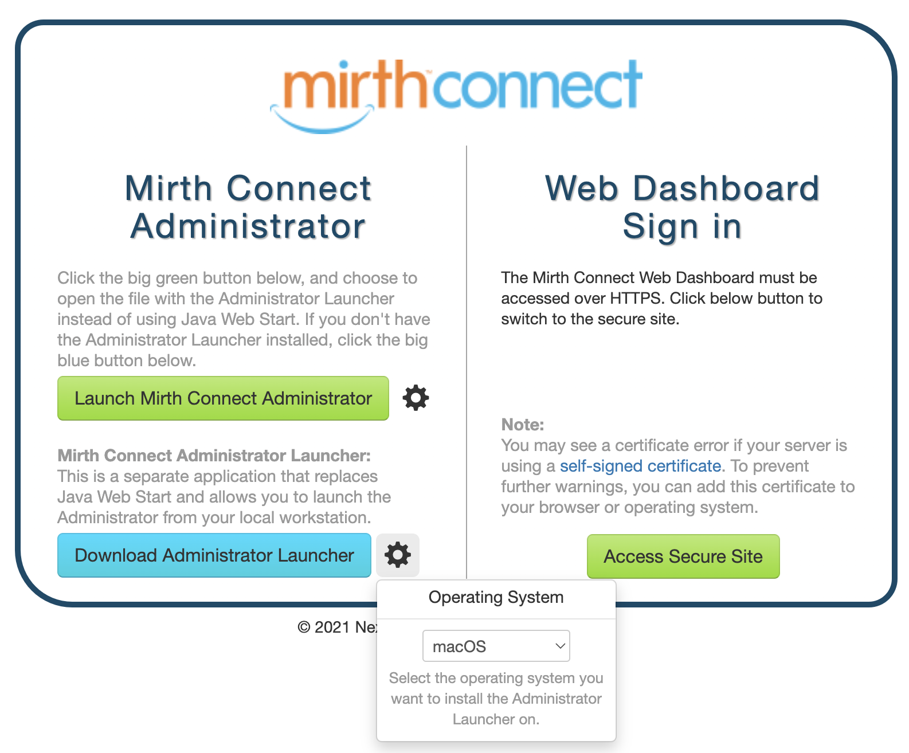
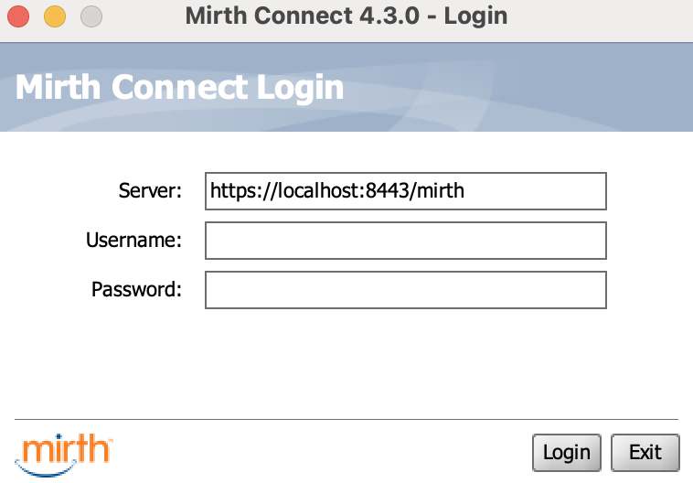
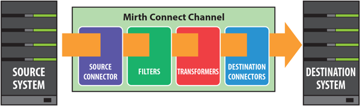
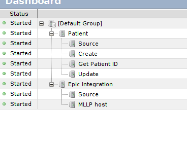
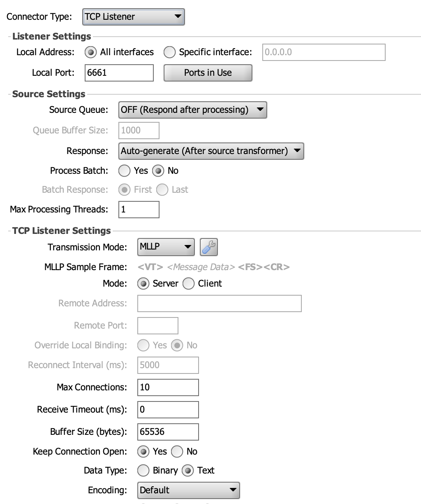
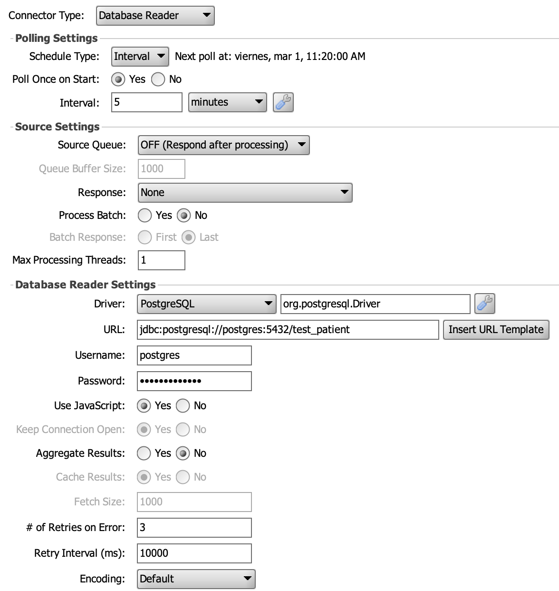
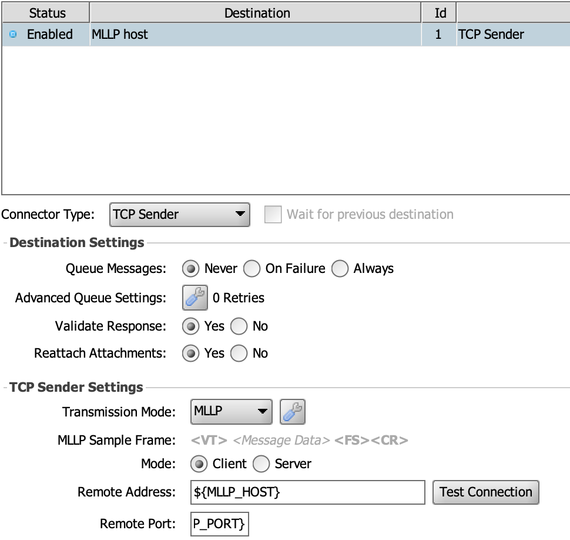

<div align="center">
  <br>
  
  <h1>Mirth</h1>
  </br>
</div>

This repository contains the necessary instructions to build a Docker image and synchronize the configuration files with Mirth Administrator.
Please follow the steps below for each process.

### Build Docker image

In the `script/docker` folder there are scripts for managing the mirth docker image:

- scripts/docker/build-image.sh - Builds the docker image
- scripts/docker/exec.sh - Execs into the containers
- scripts/docker/rm.sh - Deletes the container
- scripts/docker/run.sh - Runs the container
- scripts/docker/start.sh - Starts the container (if stopped)
- scripts/docker/stop.sh - Stops the container (if running)

Building the Docker image depends on the operating system you are using. Use the following command to build the Docker image base on your platform:

```
docker build -t sibel-mirth:local -f Dockerfile ../../. --platform linux/amd64
```

If you are using ARM-based systems-on-a-chip run the following command instead:

```
docker build -t sibel-mirth:local -f Dockerfile ../../. --platform linux/arm64
```

This command will create a Docker image with the tag **mirth** using the Dockerfile in the current directory.<br>
The --platform option specifies the platform architecture for the image, either linux/amd64 or linux/arm64.

### Synchronizing the Configuration

Before synchronizing the configuration files, make sure you have Java installed on your system.<br>
Follow these steps to synchronize the configuration with Mirth Administrator:

**Download and unzip Mirth launcher**

```sh
curl -L -O https://github.com/SagaHealthcareIT/mirthsync/releases/download/3.1.0/mirthsync-3.1.0.zip
unzip mirthsync-3.1.0.zip -d ./sync
```

**Pull the data from Mirth Administrator**

To pull the configuration data from Mirth Administrator, run the following command:

```sh
./sync/mirthsync.sh -i -f -s https://localhost:8443/mirth/api -u admin -p admin pull -t ./tucana_config
```

**Push the data to Mirth Administrator**

To push the configuration data to Mirth Administrator, run the following command:

```sh
./sync/mirthsync.sh -i -s https://localhost:8443/mirth/api -d -u admin -p admin push -t ./tucana_config
```

**The options used are**

-i : Ignore any SSL certificate errors.<br>
-f : Force a pull, even if the configuration has not changed.<br>
-s : The URL of the Mirth Administrator API.<br>
-u : The username for the Mirth Administrator account.<br>
-p : The password for the Mirth Administrator account.<br>
pull : Command to pull the configuration data.<br>
push : Command to push the configuration data.<br>
-t : The target directory to store the configuration files.<br>

# Mirth Connect Administrator

Once you have the image running type http://localhost:8080/mirth in your browser.



Install the admin launcher (if not installed) by clicking the blue button and selecting your operating system in the gear button before (it's also available on Nextgen's [website](https://www.nextgen.com/solutions/interoperability/mirth-integration-engine/mirth-connect-downloads)).

Finally, launch the administrator, click the green button, and execute the download file.



_Username: admin - Password: admin_

# Channel Configuration

Mirth Connect is an integration engine that can receive data from a variety of sources and take powerful actions on that data, including sending the data out to multiple external systems. It can also transform data from one format to another, or extract pieces of the data that you can act on or send outbound. The interfaces you configure that perform these jobs are called channels.


In this setup, we have defined two channels: one for patient data, which involves listening for HL7 messages sent over TCP, and another for Epic integration, which reads from the database and sends the data to an MLLP server.

A Mirth Connect channel consists of multiple connectors. A connector is a piece of a channel that does the job of getting data into Mirth Connect (a source connector) , or sending data out to an external system (a destination connector) . Every channel has exactly one source connector, and at least one destination connector. Because a channel may have multiple destination connectors, it can be thought of as a process that obtains data from a particular source, and sends it out to many different places. For example you may receive data over HTTP, then write the data out to a file somewhere, and also insert pieces of the data into your custom database.


## List of currently deployed channels, their source and destination

### Patient channel

This source connector listens for messages coming in over a TCP connection. It listens on a TCP interface/port and waits for clients to connect. There are options to decide when to keep connections open, and how many clients can connect at once. Configurable transmission modes allow you to decide how to receive inbound messages and send responses. This destination connector sends an HTTP request to an external web server, Central Hub.



#### Configuration of the TCP listener

The TCP Listener is set to listen on port 6661. When a message is received, Mirth transforms it and forwards it to the Central Hub.

HTTP destinations

The endpoints where the messages will be received are configured in the destination step.

### Epic integration channel

This Database Reader connects to an external database, performs a query, and reads selected rows into messages that get dispatched to the channel. This is done using JavaScript mode to perform the query manually. The database connection will automatically be kept open across multiple polling windows, unless otherwise specified. The values selected from the query will be automatically converted into an XML document where each column will be a separate node. That XML document is what actually gets dispatched to the channel as a message.
This destination connector opens a new TCP client connection and sends messages over it.



#### Configuration of the Database reader

The Database Reader is configured to run periodically with a custom SQL query.
When the results are received, Mirth will loop through each row of the executed query and send one by one to the destination.



#### Configuration of the MLLP destination

The destination is configured to map the values to HL7 v2.6 and send it to the configured MLLP host and port.

## Test Epic Integration Channel

To assert that the messages are being generated and sent correctly, IT administrators can use the mock MLLP server running on the emulator app that exposes an API to retrieve the latest messages.
In order to conduct an end-to-end verification, Mirth has to be configured with the MLLP host value as emulator and the port should be 2575.
This API will hold a number of messages that can be accessed by doing a GET request to `/emulator/mllp?limit=10` where limit is the amount of messages that will be sent.
The structure of the messages will be as follows:

```
[
 {
    "content": "string",
    "timestamp": "2024-02-21T16:57:30.888Z"
  }
]
```

After receiving these messages, the API will remove them.
The amount of messages that can be stored in the API is a configurable number with the default set to 1024.
